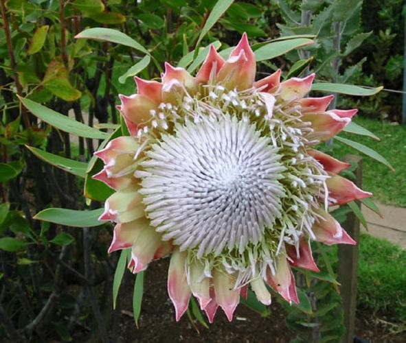

# 基于resnet152模型的迁移学习-102花朵分类

实际上，很少有人从头开始训练整个卷积网络（使用随机初始化），因为拥有足够大小的数据集相对很少。
相反，通常在非常大的数据集上对ConvNet进行预训练（例如ImageNet，其中包含120万个具有1000个类别的图像），
然后将ConvNet用作初始化或固定特征提取器以完成感兴趣的任务

----

<table style="width:100%">
  <tr>
    <td>
      
    </td>
    <td align="center">
        
    </td>
    <td>
      
    </td>
  </tr>
</table>

# 描述

采取在ImageNet上进行预训练的ConvNet，删除最后一个完全连接的层，然后将ConvNet的其余部分视为新数据集的固定特征提取器

> 该层的输出是针对像ImageNet这样的不同任务的1000类分类

# 要求

PPython 3.7或更高版本，pip install -U -r requirements.txt包括以下所有软件包：
- `torch >= 1.2`
- `opencv-python`
- `Pillow`

# 讲解

* 基于[102种鲜花](https://god.yanxishe.com/54)数据集
* lableToImageFolder.py 处理数据，用于整理适用于DataLoader格式的数据
* data/54_data 是数据集，测试集和训练集数据相同
* data/102_data 是数据集，测试集和训练集数据不同
* model/resnet/ 存放预训练模型及训练好的模型
* model/best_4990_94.pt 训练好的模型，第4990次批训练

# 训练

> 具体请参见train.py部分

**开始训练:** `python3.6 train.py`

## 模型

> 从以下位置下载： [百度网盘 密码:6w3r](https://pan.baidu.com/s/19acqKjAfqP4yJGVbfHG13Q  )

**GPU：** Nvidia RTX 2080 12G

**数据集：** 102_data (102类别-54_data整理而来)

**命令：** python3.6 train.py

GPU | data  | Loss | Acc | epoch |
--- |--- |--- |--- |--- |
| RTX 2080 12G | best_4990_94 `102_data` | 0.1955 | 0.9454 | 4990 |
| RTX 2080 12G | best_100_80 `54_data-基于102_data数据集模型继续训练` | 4.3695 | 0.8007 | 100 |

# 推理

> 具体请参见 `test.py` 部分

```bash
python3.6 test.py
```

# 预训练模型

从以下位置下载： [百度网盘 密码:6w3r](https://pan.baidu.com/s/19acqKjAfqP4yJGVbfHG13Q  )

> pretrained 为True的时候，加载resnet152模型参数，进行迁移学习

```python
if __name__ == '__main__':
    train = TrainModel(pretrained=True)
    train(5000)
```
----
